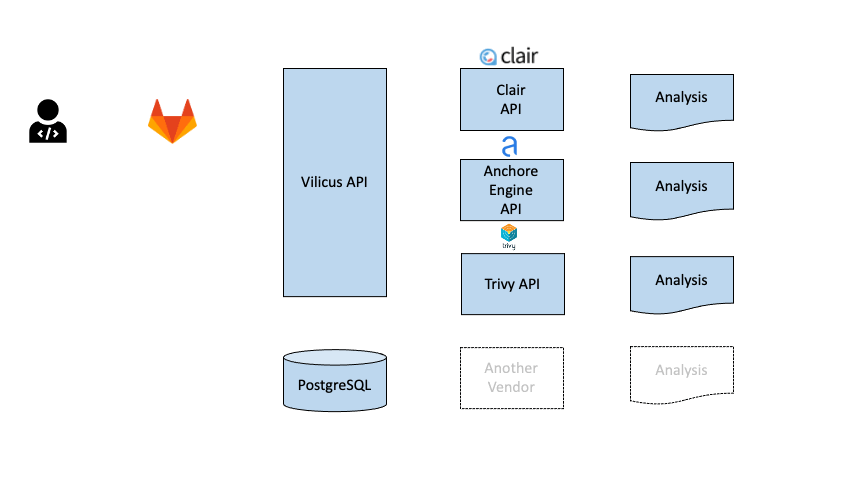

# Vilicus

<p align="left">
  <a href="https://github.com/edersonbrilhante/vilicus/releases"></a>
  <a href="https://travis-ci.com/edersonbrilhante/vilicus.svg?branch=main"></a>
</p>

# Table of Contents
- [Overview](#overview)
  - [How does it work?](#how-does-it-work)
- [Architecture](#architecture)
- [Development](#development)
    - [Run deployment manually](#run-deployment-manually)
- [Usage](#usage)
    - [Example of analysis](#example-of-analysis)

---

## Overview
Vilicus is an open source tool that orchestrates security scans of container images(docker/oci) and centralizes all results into a database for further analysis and metrics. It can perform using Anchore[https://github.com/anchore/anchore-engine], Clair[https://github.com/quay/clair] and Trivy[https://github.com/aquasecurity/trivy]

### How does it work?
There many tools to scan container images, but sometimes the results can be diferent in each one them. So the main goal of this project is to help development teams improve the quality of their container images by finding vulnerabilities and thus addressing them with anagnostic sight from vendors.

**Here you can find articles comparing the scanning tools**:
- [Open Source CVE Scanner Round-Up: Clair vs Anchore vs Trivy](https://boxboat.com/2020/04/24/image-scanning-tech-compared/)
- [5 open source tools for container security](https://opensource.com/article/18/8/tools-container-security)

---

## Architecture


---

## Development
### Run deployment manually
```bash
docker-compose -f deployments/docker-compose.yaml up -d
```

---

## Usage

### Using vilicus client
```
curl -o /tmp/wait-for-it.sh https://raw.githubusercontent.com/vishnubob/wait-for-it/master/wait-for-it.sh
chmod +x /tmp/wait-for-it.sh
curl -o docker-compose.yml https://raw.githubusercontent.com/edersonbrilhante/vilicus/main/deployments/docker-compose.yml
docker-compose -f docker-compose.yml up -d
/tmp/wait-for-it.sh http://localhost:8040 -- docker exec vilicus vilicus-client -p /run/conf.yaml -i <image>
```

### Example of analysis
```bash
 curl -XPOST 'http://localhost:8040/analysis' \
-H 'Content-Type: application/json' \
-d '{"image":"node"}'
```

<details>
  <summary>Example Result</summary>
  
  ```json
    {
      "id": "be89226e-ff60-4e04-8804-e091529742c3",
      "image": "node",
      "status": "finished",
      "created_at": "2021-02-02T20:02:20.775067Z",
      "updated_at": "2021-02-02T20:07:11.059549Z",
      "vilicus_results": {
        "clair": {
          "unknown_vulns": [{
            "fix": "0:0",
            "urls": [
              "https://cve.mitre.org/cgi-bin/cvename.cgi?name=CVE-2018-0501"
            ],
            "name": "CVE-2018-0501",
            "severity": "Unknown",
            "package_name": "apt",
            "package_version": "1.4.11"
          }]
        },
        "anchore_engine ": {
          "high_vulns": [{
              "fix": "None",
              "urls": [
                "https://security-tracker.debian.org/tracker/CVE-2020-27843"
              ],
              "name": "CVE-2020-27843",
              "severity": "High",
              "package_name": "libopenjp2-7",
              "package_version": "2.1.2-1.1+deb9u5"
            }
          ]
        },
        "trivy": {
          "high_vulns": [{
              "fix": "",
              "urls": [
                "https://gcc.gnu.org/viewcvs/gcc/trunk/gcc/config/arm/arm-protos.h?revision=266379&view=markup"
              ],
              "name": "CVE-2018-12886",
              "severity": "High",
              "package_name": "cpp-6",
              "package_version": "6.3.0-18+deb9u1"
            }
          ]
        }
      }
    }
  ```
</details>